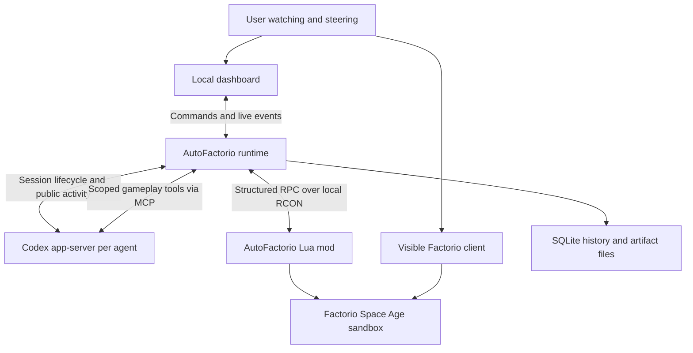

# AutoFactorio architecture proposal

Status: proposed on 10 September 2026. Product scope is approved. This design is ready for review and an implementation feasibility milestone; it is not a claim that integrations have been tested.

The adversarial review corrections approved on 11 September 2026 are part of this baseline. See [decision 001](decisions/001-review-hardening.md) for their scope and validation gates.

## 1. Recommended stack

| Layer | Choice | Reason |
| --- | --- | --- |
| Local runtime | Node.js 24 LTS, strict TypeScript, pnpm workspaces | Shared contracts across orchestration, agent integration and UI; one main application language. |
| Game integration | Lua mod using the installed Factorio runtime API | Direct structured state and deterministic actions under real game rules. |
| Reasoning provider | Local Codex app-server, managed ChatGPT sign-in, stdio transport | Supports the subscription constraint and a custom visible control experience. |
| Agent tools | AutoFactorio MCP server with role-scoped tools | A small, explicit gameplay interface usable through Codex without exposing the entire application. |
| Local HTTP service | Fastify; HTTP commands and Server-Sent Events for live updates | Straightforward request handling and resumable one-way event delivery. |
| Dashboard | React, Vite, TypeScript, ordinary CSS | Live agent views, history, task dependencies, metrics and steering. No cloud deployment required. |
| Persistence | SQLite with WAL and a single runtime writer; files for large artifacts | Reliable local history and relational queries without maintaining a database service. |
| Validation | Zod at TypeScript boundaries; exported JSON Schema and matching Lua validation | Catch malformed messages before side effects; one contract vocabulary. |
| Tests | Vitest, Playwright, deterministic fake adapters, live Factorio integration checks | Test orchestration cheaply and game behavior in the actual engine. |
| Distribution | Local Node launcher plus installable Factorio mod | Windows-first; no mandatory WSL, Docker, Electron, cloud service, or Python runtime. |

Node 24 is the proposed LTS baseline; consult [Node's release table](https://nodejs.org/en/about/previous-releases) during setup. The 10 September shell observation was Node 20.10.0; recheck after the user's upgrades and arrange a supported runtime without silently replacing the system installation. Exact library versions are chosen and locked during implementation. [Vite](https://vite.dev/guide/), [Fastify](https://fastify.dev/docs/latest/), and [SQLite WAL](https://www.sqlite.org/wal.html) provide the relevant platform guidance. Select and validate the SQLite driver on Windows in milestone 0; `better-sqlite3` is the initial candidate, not an assumed installed dependency.

Python remains an optional offline analysis tool. There is no model-training workload here that justifies requiring Python in the main application.

## 2. Component boundaries



Build a modular monolith: one local application service and database, with well-defined internal modules. Codex and Factorio are child/external processes, not an excuse to introduce a fleet of microservices. Use one current sandbox run per runtime initially.

Three authorities remain separate:

- Factorio is authoritative for world state and completed game effects.
- AutoFactorio is authoritative for tasks, permissions, reservations, experiment metadata and orchestration.
- The evaluator is authoritative for measured success. Agents propose plans and explanations; their prose cannot change any of those authorities.

The browser observes and sends commands. It does not hold the run alive or own authoritative state. A dashboard reconnect must reload from a durable event cursor. Runs can continue if its tab closes; the user can reopen and inspect them.

## 3. Codex integration and subscription boundary

Official guidance recommends app-server for custom clients handling authentication, history, approvals and streamed agent events. [Codex SDK guidance](https://learn.chatgpt.com/docs/codex-sdk).

The documented app-server supports stdio, managed ChatGPT authentication, resumable sessions, steering, interruption, model discovery, usage notifications and public activity events. Its dynamic-tools extension is experimental; use normal MCP tools initially. [App-server documentation](https://learn.chatgpt.com/docs/app-server).

Initial inspection found `codex-cli 0.153.4` with app-server labeled experimental; the subsequent 10 September review observed CLI 0.154.0 without exercising the integration. Recheck, pin a tested Codex build and isolate protocol details in `packages/codex`. Generate protocol types from that executable where supported. Unknown optional events should be retained safely and ignored by projections; missing required capabilities should block a run with a clear diagnostic.

Proposed provider boundary: start/resume a session, begin a turn, steer a turn, interrupt it, receive activity, discover capabilities and models, and read available usage. Domain code never directly calls a Codex protocol method.

Start with one app-server process per agent instance for lifecycle and role-profile isolation. This is a proposed operating choice to test, not a concurrency guarantee. All instances use the same account allowance. Do not create a desktop sidebar task for every gameplay turn. These are application-managed provider sessions, identified in AutoFactorio's UI.

Require managed ChatGPT authentication and disable API fallback. Let Codex manage credentials; do not read, export or proxy the user's browser cookies or OAuth tokens. Use per-launch configuration rather than editing the user's global Codex settings. Discover Astra in the chosen client and record the actual model and effort. Never silently substitute another model or paid provider.

Codex supports forced login method and tool configuration; those settings must be checked against the pinned executable. [Configuration reference](https://learn.chatgpt.com/docs/config-file/config-reference). Account allowance remains subject to plan behavior. No guaranteed unlimited play or exact conversion from tokens to subscription balance is assumed. [Authentication](https://learn.chatgpt.com/docs/auth).

Budget policy: default roster size two, maximum two simultaneous provider turns, no inference for polling, and no automatic paid credits or resets. A provider turn is one submitted request and the agent work that follows, potentially including many model inferences and tool calls; it is not a unit of inference cost. Count provider turns, gateway tool-call attempts (including rejected calls), elapsed turn time, and reported token usage separately. Use configurable run-wide turn and wall-time caps, per-turn elapsed-time and tool-call caps, and a run-wide token ceiling when usable provider telemetry exists. Record the values, accounting scope, and supported enforcement before launch. Turn limits apply across the roster; retries and replacement sessions do not reset spent budgets.

Enforce elapsed-time limits with deterministic monotonic timers and tool limits at the gateway before dispatch. The turn-count cap limits new-turn admission: the last admitted turns may finish under their remaining per-turn and run execution limits. Use deduplicated provider usage updates to interrupt on the configured token ceiling where supported. Delayed or missing telemetry makes token and subscription ceilings approximate; display unknown usage honestly and retain the independent time/tool limits. Never infer remaining subscription allowance from turn counts or promise a hard subscription-spend bound.

When a per-turn limit is reached, close that turn's tool admission, request interruption, and reconcile any orders it already submitted before the scheduler decides on recovery under the remaining run budget. When a run execution limit (such as wall time or a reported token ceiling) or account allowance is exhausted, atomically block new turns and tool admission for the entire run, interrupt all active turns, revoke/cancel queued game work through the acknowledged protocol below, and checkpoint when possible. Late provider output is retained as evidence but cannot admit new actions. An unacknowledged interrupt or cancellation remains visibly unconfirmed; do not treat it as completed or silently restart inference.

## 4. Agent coordination

Own a small deterministic task scheduler. Do not depend on LangChain, LangGraph, or Codex's native subagent tree for persistent business state. A durable dependency graph and a few explicit task states are enough initially. Framework adoption can be revisited if a concrete requirement warrants it.

An agent definition contains its role, instructions, allowed tool groups, observation scope, model preference, output expectations and limits. An instance has a stable identity, current assignment and provider-session lineage. Creating a specialist adds a definition and any genuinely new domain tools, not a new communication system.

The initial foreman creates and assigns tasks. The engineer handles layout decisions and construction. Agents can request assistance or propose decomposition. The runtime validates assignments, routes messages, rejects cycles and enforces ownership. Agents cannot recursively launch unlimited sessions.

Suggested task lifecycle:

`proposed -> ready -> assigned -> running -> verifying -> succeeded`

Explicit additional states: blocked, failed, cancelled and superseded. Completion requires a criterion and evidence. Numeric factory targets use deterministic evaluator results. A specialist's completion report is a claim until verified.

Represent reservations for construction areas, resource allocations and physical characters. Acquire the required reservation set atomically in a consistent order; conflicting work waits or returns to the foreman. A lease has an owner and fencing generation, so expired or replaced agents cannot issue valid old commands. Runtime-assigned identity must not be accepted merely because an LLM includes an `agent_id` argument.

Lease changes use an acknowledged game-side fence. Node first persists revocation intent and closes admission for the affected assignment. Lua then advances the affected resource/actor generations, stops their active execution at a bounded safe boundary, cancels their queued steps, and returns an acknowledgement with final receipts and the effective tick. Only after reconciliation and that acknowledgement may Node activate replacement ownership in Lua and dispatch replacement work. Retries use the same revocation ID; an older grant or arm request cannot lower a generation. A timeout leaves the reservation unavailable, even if its Node lease has expired.

Lua checks the installed epoch, control session, task revision and every required reservation generation at admission and before each side effect, including continuing per-tick movement, mining or crafting. Carry all affected reservations, not only the character lease, in a batch. Reprioritization fences obsolete task revisions so a late result from the same agent cannot revive an old plan. Revocation acknowledgement means no further effects from that authorization can occur; already completed effects and any legal cancellation refunds remain in the receipt.

One character executes one action lane at a time. Multiple characters may act concurrently. Their leases and local checks still protect overlapping space and shared inventories. Failures return specific reasons rather than escalating every conflict to an LLM discussion.

The runtime wakes agents on assignment, meaningful completion/failure, actionable factory change, dependency resolution, or user input. Coalesce repeated alerts. Use bounded deterministic sensor polling internally; polling itself costs no reasoning turns. A provider turn that ends normally does not imply the overall run has finished.

## 5. Contracts and state freshness

Keep transport-neutral schemas in `packages/contracts`. Prefer prototype names and explicit properties over a hand-maintained universal enum of Factorio items.

| Contract | Essential contents |
| --- | --- |
| Run manifest | Run ID, scenario/version, seed, game/mod versions, code commit, roster, model/effort, instruction hashes, assistance settings, budgets, clocks |
| Task | ID, goal/parent, owner, dependency IDs, scope, required resources, success criteria, deadline, revision and evidence references |
| Observation | ID, run epoch, game tick, surface, scope, entities/metrics, coverage, freshness, pagination/truncation and source |
| Action batch | Command ID, run epoch, control session, task/revision, assigned actor, reservation IDs/generations, expected local conditions, ordered steps, deadline and failure policy |
| Action receipt | Command ID, accepted/running/completed/partial/failed/cancelled/unknown, actual completed steps, inventory deltas, ticks and reason codes |
| Control fence | Idempotent request ID, run epoch, control session, affected task/revision and reservations, target generations, revoke/grant/disarm/arm operation, acknowledgement tick and receipt references |
| Agent message | Sender/recipient, task reference, intent, concise content, related observation or evidence references |
| Intervention | Exact text, recipient, wall time/game tick, delivery and acknowledgement state, superseded plan/task references |
| Event | Schema version, run ID/epoch, monotonic sequence, wall time, optional game tick, type, actor, task, correlation/causation IDs, visibility/authorized scope, payload reference |

A surface identifier is required for positions. Item quantities identify quality. Recipes can describe multiple inputs/outputs, fluids, probabilities and productivity restrictions. Implement only the calculations exercised by early scenarios first; return an explicit unsupported result for unimplemented advanced mechanics. Do not flatten richer recipes into incorrect fixed ratios.

Use run epochs to reject messages from a reset or restored world. Do not invalidate every command merely because the global tick advanced: the game is running. Validate relevant preconditions immediately before each action, such as inventory, reach, entity identity, reservation and target occupancy.

## 6. Game interface and deterministic actions

Prefer a focused AutoFactorio mod exposing versioned structured requests through a named remote interface, transported over local RCON. The TypeScript transport constructs and encodes the fixed RPC wrapper; model output is data, never raw Lua or console text. Keep the transport replaceable; current Factorio also offers local UDP, but that does not justify adding an unreliable transport before the reliable path is proven.

The mod owns character execution, local collision/reach checks, item accounting, per-tick tasks, action receipts and bounded observation queries. Node owns long-term plans, provider sessions, records and the UI. A Node timer does not simulate game movement or crafting.

Expose a small initial vocabulary: inspect an area/entity, read recipes and inventories, calculate requirements, validate a layout, submit a batch, inspect/cancel orders, report task progress and send scoped messages. Arithmetic and ratio tools calculate; layout tools execute the agent's design. They do not automatically choose the entire production system.

Batch execution is asynchronous: return an order ID promptly and report progress. Initial suggested cap: 100 steps, with smaller cancellable execution units. Fail on an unexpected condition by default and return a partial receipt. Never present a partially placed factory as an atomic transaction or assume that undo is free.

Persist command IDs and step receipts in the mod's saved state. If a request times out, query its receipt before retrying. Across a save rollback, reconciliation needs an epoch change and restored checkpoint manifest; an in-memory command cache is not exactly-once execution. Unknown outcomes block conflicting actions until inspected.

Restoring a world must not execute saved orders before reconciliation. All AutoFactorio checkpoints and cached scenario saves must contain a disarmed executor, neutral character controls and suspended/cancelled timed actions; pending intents can remain as data. The managed load path holds simulation and execution before admitting control traffic. Node verifies the save/manifest pair, reconciles restored receipts and task projections against that checkpoint, installs a new epoch/control session and current generations, then explicitly arms approved work. Do not replay post-checkpoint completed task states into the older world as if their effects survived. Delayed traffic from the previous session is rejected.

An arbitrary/native autosave with potentially armed orders is not an approved automatic recovery source. Refuse automatic continuation unless the pinned engine's load path can establish the same pre-execution barrier; otherwise recover from a validated disarmed checkpoint. A user-opened uncontrolled save cannot be claimed to have preserved this guarantee. Do not implement load fencing by mutating persistent state in Lua's `on_load`; prove a multiplayer-safe lifecycle in milestone 0. The heartbeat watchdog disarms execution on control loss; a subsequent heartbeat alone never re-arms it.

Provide deterministic character pathing, correctly timed mining/crafting, legal placement, rotation, transfers and deconstruction. Reuse tested implementations where possible. Scenarios preauthorize rebuilding within assigned construction areas; do not inherit a requirement to ask the human for every ordinary deconstruction. Scenario fixtures remain protected.

The observer client shows the real game; normal runs are not invisible. Initial setup should use a dedicated hosted sandbox save in the user's normal Windows Factorio client. A managed server plus attached client is a later operational option if needed. Automated engine tests may run without graphics. Keep configuration and saves isolated from the user's personal games; copy the mod into the controlled mod directory instead of depending on Windows symlink privileges.

## 7. Context and memory

Maintain three information levels:

1. Briefing: objective, current task, reservations, recent outcomes, production/power alerts and outstanding steering.
2. Scoped detail: exact entities and inventories in the assigned area, relevant recipes, previous failed attempts and dependency outputs.
3. Archive: authorized recorded observations, action history, artifacts and public provider events, retrieved by ID/query. The observer's full archive is a separate access scope.

Set configurable response byte/entity limits with pagination and explicit omissions. Record the exact observation returned to the agent, separately from the richer telemetry collected for analysis. This lets a retrospective distinguish poor reasoning from missing information. Cache recipe data by the complete game/mod fingerprint and query dynamic recipe availability separately.

Canonical memory is structured task and game evidence. Model-written explanations and lessons are supplementary and carry provenance. On compaction or session replacement, regenerate a briefing from durable state, include relevant unresolved interventions, then refresh world observations. Provider transcript resumption is useful but never the only recovery mechanism.

Fresh context should be task-local. Do not stuff foreman deliberations into every engineer session or retain a full map in every prompt. Use module-scoped instructions and a small role tool catalog.

Every event and artifact has an explicit visibility class: gameplay-shared within a run, restricted to named roles/tasks/agents, or evaluator/operator-only. Missing labels deny gameplay access. The server applies the authenticated agent's current authorization to direct IDs, search results, counts/snippets, pagination, payload downloads and transitive references. Knowing an ID or having permission to call a history tool grants no additional visibility. Replacement-session briefings, summaries and derived artifacts must preserve source restrictions; use explicit sanitized projections when releasing allowed information. Role assignment does not grant access to hidden evaluator history.

Reference construction commands, fault seeds/injection events and their detailed receipts remain evaluator/operator-only even when they use the ordinary action gateway. Gameplay may observe the resulting world through its normal queries, but cannot retrieve the hidden construction plan or fault explanation. Keep raw saves and full observer exports out of gameplay retrieval. Test direct-ID and search attempts, cross-role requests, referenced payloads and regenerated briefings, not only the visible tool catalog.

## 8. Persistence, observability and controls

Use an append-only event table with transactional projections for runs, agents, tasks, messages, observations, commands, measurements, interventions and checkpoints. The single Node writer commits command intent and an outbox entry before dispatch. Reconcile outbox status against game receipts after a crash. The UI and reports read projections; the event log explains their changes.

Large JSON observations, readable transcripts and save ZIPs live in a local artifacts directory with checksums and database references. Keep SQLite and its WAL on a local disk, not a synchronized network folder. Export consistent database backups through the driver's backup mechanism rather than copying a live main database file alone.

Store user-visible provider events, tool arguments/results, explicit decision explanations, and available usage metadata. Redact credentials. Record run retention limits and report disk pressure; never silently drop evidence while continuing to call a run fully recorded. NDJSON and CSV exports support later mining without requiring the app.

Dashboard layout: run status and production chart; agent roster and current activity; task dependency view; timestamped timeline with observation/action detail; steering input; pause/stop/resume; run comparison and intervention review. Explanations should state intended outcomes before action. Label retrospective inferences as such. A decision graph shows recorded decisions, not hidden cognition.

Steering is first persisted, then routed. Acknowledge receipt separately from agent understanding. Ordinary advice can arrive during reasoning or at the next turn. Advice does not retroactively cancel an already submitted construction batch. Pause/stop and explicit reprioritization invalidate conflicting pending orders. Duplicate delivery must not duplicate assignments.

Pause blocks new work, interrupts inference and pauses the controlled sandbox simulation once safe cancellation is confirmed. Stop blocks new work and cancels orders without deleting the world. Resume reconciles receipts and refreshes state. If the game is disconnected, report cancellation/checkpoint as unconfirmed. An in-game heartbeat watchdog must stop character activity when runtime control is lost; it cannot guarantee a disk save if the game itself crashed.

Use `game.tick` relative to the run/verification origin for simulation deadlines and scoring; record wall time independently. Validate `game.tick_paused` with `ticks_to_run = 0` on the pinned game and explicitly gate mod-driven mutations while paused. Do not substitute the GUI/server pause state or `ticks_played` for the experiment clock. RCON polling must not advance scoring, production, queued effects or scenario injections while paused. A budget/deadline stop closes scoring under that budget; a later continuation cannot silently earn output past the limit. Ordinary user stop preserves progress for a reconciled, recorded resume.

A consistent checkpoint closes admission, acknowledges executor disarm, pauses simulation, and captures the game save plus command ledger and event sequence. Confirm save completion and checksum before publishing the manifest as restorable; incomplete captures remain unusable. Only then resume the current world if appropriate through an acknowledged arm operation. Starting from a checkpoint creates a new run branch with a parent reference and uses the restore barrier in section 6. Historical event replay reconstructs the recorded UI; exact re-simulation is a distinct feature requiring matching engine, mods and action timing. Re-running the model is never promised to reproduce its choices.

## 9. Experiment integrity

Separate setup/admin functions from gameplay tools. Agents cannot spawn resources, rewrite fixtures, change research grants or edit the evaluator. Their MCP connection has an enforced role identity and no raw RCON credentials. Host/UI control routes require a local session capability and origin checking; bind to loopback.

Use an isolated gameplay workspace and effective tool allowlists. Disable general shell, editing, unrelated connectors, browser access, native subagent creation and any other routes that bypass the gameplay gateway. Verify the effective catalog against the installed Codex build rather than relying on a prompt. [MCP configuration](https://learn.chatgpt.com/docs/extend/mcp). If effective restriction cannot be established in milestone 0, label runs unverified and resolve it before claiming benchmark integrity. AutoFactorio development agents retain normal coding tools; gameplay agents have a different profile.

Factory success is computed from engine-observed production and designated automated output, never from natural-language judgment. Fault cause metadata and reference layouts are available to the evaluator and observer, not the playing role. Fixture state and actual output must be checked after interruptions or human edits.

The evaluator enforces the verification-phase mutation policy and required upstream flows in SCENARIOS, including quantitative fuel supply and failing do-nothing fault controls. Final science production alone is insufficient. Store measurement baselines, coverage, inventory balances and any allowed tolerances as evidence. Missing causal/flow coverage invalidates verification; neither topology alone nor unrelated production counters establish an automated chain.

## 10. Reuse decision

Create an AutoFactorio-owned repository and contracts. Evaluate selective reuse before rebuilding pathing, legal placement or batch machinery. Do not adopt an upstream agent loop as the authority for our tasks and records.

- FLE: useful evaluation and game-tool reference; it has an explicit MIT license. Its current Python dependency list includes evaluation, provider and environment dependencies that would add a second required application runtime. Prefer selective reuse or a bounded adapter over adopting the entire stack. [FLE package](https://github.com/JackHopkins/factorio-learning-environment/blob/main/pyproject.toml), [license](https://github.com/JackHopkins/factorio-learning-environment/blob/main/LICENSE).
- Agentic-Factorio: particularly relevant character and batch behavior. Its protocol documents starter blueprint provisioning, per-character queues, partial results and a four-character limit. Benchmark defaults would need adjustment. [Protocol](https://github.com/matteomekhail/Agentic-Factorio/blob/main/docs/PROTOCOL.md).
- Its README states MIT, but a standalone LICENSE was not verified in this research. Inspect the selected revision and establish applicable notices before copying code. Space Age support also needs actual tests; declaring Factorio 2.0 compatibility does not prove full expansion behavior. [README](https://github.com/matteomekhail/Agentic-Factorio), [mod declaration](https://github.com/matteomekhail/Agentic-Factorio/blob/main/mod/agentic-companion/info.json).

Milestone 0 should select the smallest suitable game foundation and record the exact upstream revision, notices, retained behavior and changes. If neither is suitable, implement the limited first-scenario action set behind the same adapter. Do not spend the entire milestone building a universal compatibility framework.

## 11. Proposed repository structure

```text
autofactorio/
  README.md
  AGENTS.md                       # Short instructions for coding agents
  package.json
  pnpm-workspace.yaml
  pnpm-lock.yaml
  tsconfig.base.json
  apps/
    runtime/src/                  # Composition, launcher, HTTP/SSE, lifecycle
    dashboard/src/                # React operator interface
  packages/
    contracts/src/                # Versioned schemas and public domain types
    core/src/
      orchestration/              # Task graph, scheduling, messages, leases
      context/                    # Scoped briefings and evidence retrieval
      execution/                  # Action admission, budgets and reconciliation
      evaluation/                 # Scoring and intervention classification
    codex/src/                    # Provider adapter and protocol compatibility
    factorio/src/                 # RCON, RPC, observations and game adapter
    tools/src/                    # Scoped MCP surface and deterministic helpers
    storage/
      src/
      migrations/
  mods/
    autofactorio/
      info.json
      control.lua
      scripts/
        rpc.lua
        observations.lua
        actors.lua
        actions/
        receipts.lua
        watchdog.lua
        scenarios/                # Fixture and evaluator game-side logic
  agents/
    foreman/                      # Definition and role instructions
    engineer/
    teams/                        # Solo and two-role configurations
  scenarios/
    01-first-shift/
    02-some-assembly-required/
    03-hot-metal/
    04-you-are-the-infrastructure/
    05-unscheduled-downtime/
  tests/
    contracts/
    integration/
    e2e/
    fixtures/                     # Fakes, event streams and reference solutions
  scripts/                        # Portable setup, mod packaging and diagnostics
  docs/
    REQUIREMENTS.md
    ARCHITECTURE.md
    SCENARIOS.md
    IMPLEMENTATION_HANDOFF.md
    decisions/                    # Short accepted architectural decisions
  third_party/                    # Provenance/notices for reused code, if any
  .github/workflows/
```

Keep pure core modules independent of Fastify, SQLite drivers, React, Codex and RCON. Adapters implement their ports; runtime wires them together. Feature tests can live next to modules, with cross-boundary tests in `tests/`. Do not create empty future packages such as combat or planets until needed.

Runtime data belongs outside tracked source: database, artifacts, saves, per-agent workspaces and logs. The local launcher accepts an explicit data directory. The user's credentials and game assets never enter Git.

## 12. Test strategy and implementation gates

Use deterministic tests for dependency ordering, lease conflicts, duplicate events, stale epochs, late command acknowledgements, partial batches, output windows, budget stops and steering races. Fake provider responses should exercise failures without consuming subscription usage.

Include delayed game-side revocation, conflicting reassignment while disconnected, stale grant/arm messages, restored cancelled queues, and late tools after a budget stop. Exercise one long provider turn with many tool calls, deduplicated usage updates, missing usage and both active agents at exhaustion. Test archive authorization across IDs, searches, references and fresh-session briefings. Scenario evaluators need passing reference plans and failing bypass controls, including deficient fuel delivery and every unrepaired fault variant.

Real-game checks must verify legal movement, reach, inventory accounting, recipe selection, placement collisions, cancellation and save/load recovery. Lua mocks alone cannot establish these properties. Scenario reference solutions run through the same gameplay gateway as agents, with no special build privileges.

Milestone 0 must additionally prove pause while polling, a completed disarmed save, controlled reload with pending work, reconciliation and explicit re-arm in the visible hosted topology. Record both tick counters, scoring time, production, receipts and inventories across the test. A faked adapter or lost-acknowledgement test does not replace this engine evidence. Milestone 1 may build its durable controls only after this gate passes or a revised game adapter/topology passes the same gate.

UI checks cover live stream reconnection, role filters, pause/stop state, steering acknowledgements and history retrieval. Missing telemetry must show as missing rather than success.

Run software tests on Windows and Linux where practical. Licensed Space Age integration tests run locally or on an appropriately configured private runner; public CI must not depend on distributing the game. Model-backed evaluations are deliberate, budgeted experiments, not a test on every commit.

Milestones and handoff rules are specified in [the implementation handoff](IMPLEMENTATION_HANDOFF.md).

## 13. Blueprint workshop and bounded maintenance

The workshop is a durable runtime beside the scenario scheduler. Real dashboard and scenario composition roots preflight the managed ChatGPT catalog and construct the production host from the attached serial RCON port, game/lifecycle clients and Codex executable. The UI submits a brief, preset, existing revision or authorized full assignment. The host resolves every mode against the running game's active mods/prototypes, persists the real capability fingerprint and complete versioned assignment, and supplies the exact compatible parent document to an Improve session. A runtime-owned background driver, rather than the browser or HTTP handler, advances configure, build, freeze, measure, score, checkpoint, trusted library admission, learning and finalization. Provider sessions propose designs or critique immutable evidence but do not schedule themselves or establish production success. Every external effect records an intent and acknowledgement. A replacement controller reconciles an intent through its adapter or retains the session as held with an explicit unknown outcome; it never silently replays provider, measurement or learning work.

Brief, after-score, library-admission and learning-activation checkpoints persist their kind, resume stage, deadline and operator decision. Continue resumes the exact durable stage; finish records an explicit final outcome; timeout applies the manifest's finish/continue action after restart. Library admission occurs only after its checkpoint. Learning cadence first records a typed no-change, deferred-maintenance or concrete candidate/bundle outcome; an activation checkpoint is requested only when the exact bundle already has every required attestation, immediately before compare-and-swap activation. Closing or stopping cancels active provider/game work before waiting for tasks and clears checkpoint timers. Provider and game adapters must return a confirmed terminal or cancellation receipt; any rejection or missing receipt leaves the effect and session held for reconciliation.

Installed game data resolves editable starter, advanced-assembly, electromagnetic and current-run capability profiles. A profile distinguishes allowed equipment from locally manufacturable equipment and pins research bonuses and surface properties. Compatibility rejects unsupported quality, probabilistic/spoilage behavior, trains, platforms, circuit programs and dedicated mining/power designs before mutation. Direct materialization exists only on isolated workshop surfaces. Ordinary reuse compiles the same supported blueprint into bounded legal character actions with finite inventory, reach, collision, settings and receipt checks. Multi-item provisioning validates the whole request and rolls back every inserted delta on failure before the operation identity can be retried.

Canonical blueprint content excludes editable names from identity while preserving supported geometry, recipes, modules, filters, bars, entity settings and wires. SQLite indexes immutable family/variant/revision directories; content files remain authoritative and rebuild the index. Native strings intentionally omit AutoFactorio entity IDs and interface metadata because the Factorio schema does not accept them. Sanitized sidecar metadata carries ports, compatibility and evidence references. No-mod import is a required acceptance gate.

Measurement reconstructs a candidate on a clean evaluator-owned surface, freezes mutation and samples exact `(startTick, endTick]` windows. Deterministic rational arithmetic requires fresh production and sink delivery at every required port in every window. Stock drawdown, residuals, contamination, missing coverage or disconnection cannot be averaged away. Scoring retains measured, derived, subjective and unknown dimensions separately. Best-candidate and plateau decisions apply the frozen dimension weights, maximize/minimize directions, materiality tolerances and explicit unknown handling; only target-passing eligible scores can win. Private library comparison is operator-only and cannot feed a library-blind designer or scorer context.

Designer, scorer and learnings sessions pin exact managed OpenAI model and effort selections. The catalog comes from the authenticated managed provider, unsupported combinations fail without substitution, and restored selections are rechecked before every inference. One durable per-session owner admits all role invocations against aggregate turns, tool calls, elapsed provider time and reported tokens. The configured learning share is the larger turn/tool reserve ratio and partitions elapsed time and finite reported tokens between workshop and maintenance owners, so workshop calls cannot spend maintenance capacity; unknown finite-token use closes that owner's later inference. Maintenance exhaustion records a deferred outcome without blocking an already completed blueprint. Usage is attributed once by stable invocation identity, owner, role, iteration and learning batch, and survives restart. Closing the browser does not own execution; dashboard state is a projection of the journal.

Learning stores provenance-bearing outcomes and candidates under finite count and byte caps and honors after-session, bounded-batch and off cadence. It may update only typed, registered designer/scorer instruction, lesson and design-helper paths. Each proposal overlays its change on the complete effective incumbent file set and unions the incumbent control obligations with the new proposal's controls; validation, review, activation and future-session pinning therefore bind the exact cumulative bundle instead of a delta. New sessions load the pinned designer/scorer instructions and bounded lessons. A pinned helper runs once per session through the confined worker, and only a revision-matched plan containing registered suggestion/constraint actions enters the designer observation; consumption or fail-closed rejection is retained. Existing sessions retain their prior pin. Bundles declare an exact control set; every attestation of each required kind must be passing, conclusive and cover that complete set, so a later failed or inconclusive result cannot be hidden by another pass. Every nonempty registered bundle requires representative behavior evidence, including a lesson-only bundle. Helper source executes in a separate Node process with the permission model, an empty environment, read-only source, private scratch limits and a capability-free VM context; the trusted runtime validates every returned action proposal again. Node's permission model supplies filesystem and child-process isolation, while removal of `fetch`, `process`, `require` and dynamic code generation denies network and credential capabilities inside the worker. If this combined boundary or any quota/hash check is unavailable, execution fails closed without an in-process fallback.

Activation requires deterministic, interaction, representative behavior and fresh review attestations for the exact immutable combined-bundle hash. The catalog advances with compare-and-swap against the incumbent hash and generation. Sessions retain pinned bundles; rollback and quarantine choose only previously verified history for future sessions. Library evidence persists the canonical full rubric and its content hash, and comparisons proceed only when weights, directions and materiality match exactly even if a version label is reused. [Decision 017](decisions/017-blueprint-workshop.md) records the accepted scope and provenance.
